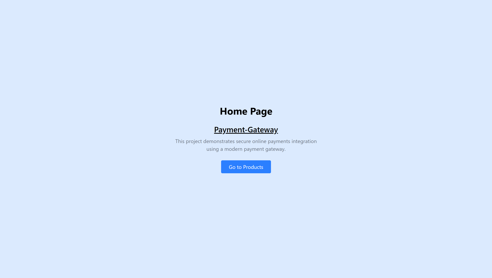
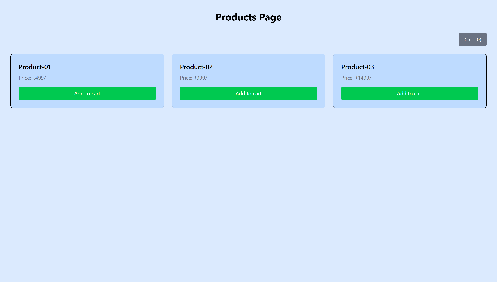
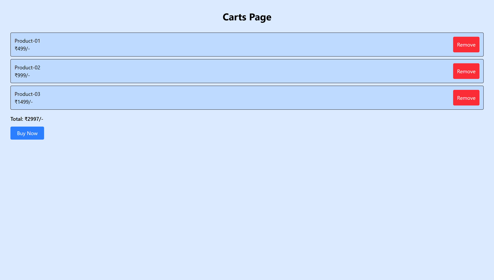

# 💳 Payment Gateway Integration (MERN Stack)

A full-stack **Payment Gateway project** built using the **MERN stack**, integrating **Razorpay** for secure online payments. This project demonstrates the complete payment flow from frontend checkout to backend verification.

---

## 🚀 Features

- Product checkout
- Razorpay payment integration
- Backend order creation
- Payment verification
- Success & failure handling
- Secure environment variables

---

## 🛠 Tech Stack

**Frontend**

- React.js
- Axios
- Tailwind CSS

**Backend**

- Node.js
- Express.js
- Razorpay SDK

---

## 💰 Payment Flow

- Click Buy Now
- Backend creates Razorpay order
- Razorpay checkout opens
- Payment processed
- Backend verifies payment

---

## 📸 Screenshots

### Home Page

- 

### Products Page

- 

### Carts Page

- 

### After Buy Now Section

- 

### Entering Card Details Section

- 

### Payment Successful Section

- 

---

## 📌 Learning Outcome

- Razorpay integration
- Secure payment handling
- MERN full-stack workflow
- API communication

---

## 🔗 Demo Link

[Live Demo(working on progress....)](https://)
